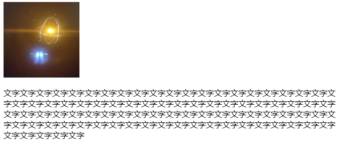
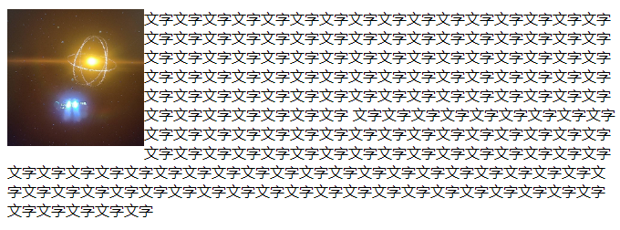
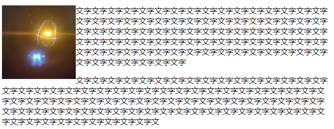
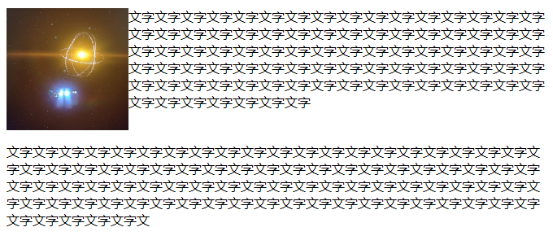

[返回](./#/css/)

# float

HTML 默认按照 流 在页面上进行排列布局，流式布局是指利用元素 流 的特性实现各种布局。 简单说，流式布局从上到下，从左到右，块状元素独占一行，内联元素非独占

而引入 float 最初也是为了实现文字环绕图片，比如下面示例，在未使用 float 的效果：

```html
<style>
  .image-container {
    width: 150px;
    height: 150px;
  }
</style>
<div class="container">
  
  <p class="word-content">
    文字文字文字文字文字文字文字文字文字文字文字文字文字文字文字文字文字文字文字文字文字文字文字文字文字文字文字文字文字文字文字文字文字文字文字文字文字文字文字文字文字文字文字文字文字文字文字文字文字文字文字文字文字文字文字文字文字文字文字文字文字文字文字文字文字文字文字文字文字文字文字文字文字文字文字文字文字文字文字文字文字文字文字文字文字文字文字
  </p>
</div>
```



图片文字独占一行，当使图片左浮动时：

```html
<style>
  .image-container {
    width: 150px;
    height: 150px;
    float: left;
  }
</style>
<div class="container">
  
  <p class="word-content">
    文字文字文字文字文字文字文字文字文字文字文字文字文字文字文字文字文字文字文字文字文字文字文字文字文字文字文字文字文字文字文字文字文字文字文字文字文字文字文字文字文字文字文字文字文字文字文字文字文字文字文字文字文字文字文字文字文字文字文字文字文字文字文字文字文字文字文字文字文字文字文字文字文字文字文字文字文字文字文字文字文字文字文字文字文字文字文字
  </p>
</div>
```



float 实现文字环绕的原理是：

1.首先，图片脱离文档流，覆盖在父级元素上（父级元素和图片是重叠的）。这也导致父级元素在计算高度时排除了图片，可能出现父级元素高度小于图片高度的情况，造成父级塌陷的感觉；\
2.其次，每行文字和图片都要保证不重叠。

但是如果这样又会引入一个新问题，添加 float 属性的元素会有父级塌陷的问题，影响后面的元素，比如：

```html
<style>
  .image-container {
    width: 150px;
    height: 150px;
    float: left;
  }
</style>
<div class="container">
  
  <p class="word-content">
    文字文字文字文字文字文字文字文字文字文字文字文字文字文字文字文字文字文字文字文字文字文字文字文字文字文字文字文字文字文字文字文字文字文字文字文字文字文字文字文字文字文字文字文字文字文字文字文字文字文字文字文字文字文字文字文字文字文字文字文字文字文字文字文字文字文字文字文字文字文字文字文字文字文字文字文字文字文字文字文字文字文字文字文字文字文字文字
  </p>
</div>
<p class="word-content2">
  文字文字文字文字文字文字文字文字文字文字文字文字文字文字文字文字文字文字文字文字文字文字文字文字文字文字文字文字文字文字文字文字文字文字文字文字文字文字文字文字文字文字文字文字文字文字文字文字文字文字文字文字文字文字文字文字文字文字文字文字文字文字文字文字文字文字文字文字文字文字文字文字文字文字文字文字文字文字文字文字文字文字文字文字文字文字文字文
</p>
```



解决这个问题，可以在使用 float 元素的父级使用 clear 清除浮动：

```html
<style>
  .container::after {
    clear: both;
    content: "";
    display: block;
  }
  .image-container {
    width: 150px;
    height: 150px;
    float: left;
  }
</style>
<div class="container">
  
  <p class="word-content">
    文字文字文字文字文字文字文字文字文字文字文字文字文字文字文字文字文字文字文字文字文字文字文字文字文字文字文字文字文字文字文字文字文字文字文字文字文字文字文字文字文字文字文字文字文字文字文字文字文字文字文字文字文字文字文字文字文字文字文字文字文字文字文字文字文字文字文字文字文字文字文字文字文字文字文字文字文字文字文字文字文字文字文字文字文字文字文字
  </p>
</div>
<p class="word-content2">
  文字文字文字文字文字文字文字文字文字文字文字文字文字文字文字文字文字文字文字文字文字文字文字文字文字文字文字文字文字文字文字文字文字文字文字文字文字文字文字文字文字文字文字文字文字文字文字文字文字文字文字文字文字文字文字文字文字文字文字文字文字文字文字文字文字文字文字文字文字文字文字文字文字文字文字文字文字文字文字文字文字文字文字文字文字文字文字文
</p>
```



**`注意`** : clear  属性只有块级元素才有效，而::after 等伪元素默认都是内联水平，所以需要设置 display 为 block,并且需要配置 content 否则该元素为空同样不生效。

其他清除浮动的方法，可参考: [BFC](./bfc.md)

[返回](./#/css/)
