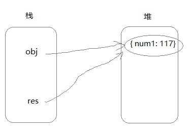
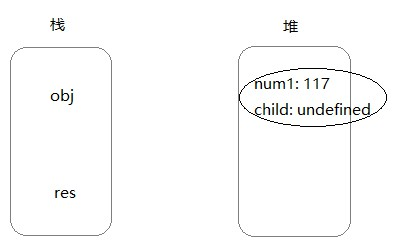
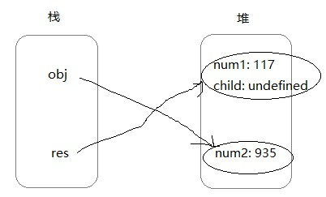

[返回](./#/js/)

### 001 结果输出

```javascript
let flag1 = null || undefined;
let flag2 = null && undefined;
if (flag1 === true) console.log("flag1");
if (flag2 === false) console.log("flag2");
```

这道题考察点： 逻辑与、或的处理，null undefined 和 false 之间的关系
|| 逻辑或运算符，如果前面为 true，则后面的不运算，如果为 false 就运算后面的，则其值为||运算符的后面的值\
flag1 为 undefined， undefined 不等于 true

&& 逻辑与运算符，如果前面为 false,则后面的不运算，如果为 true 就运算后面的，其值为&&运算符后面的值\
flag2 为 null ，null 也不等于 false，所以这题都不打印

拓展：
null == false; // false\
undefined == false; // false\
NaN == NaN; // false NaN 不等于任何变量，包括自己，判断 NaN 通过 isNAN\
null == undefined; // true\
0 == false; // true

Object.is(0, -0); 为 false
Object.is(NaN, NaN); 为 true

### 002 结果输出

```javascript
let obj = {
  num1: 117,
};
let res = obj;
obj.child = obj = { num2: 935 };
var x = (y = res.child.num2);
console.log(obj.child);
console.log(res.num1);
console.log(y);
```

最关键的是： obj.child = obj = { num2: 935 }; 这段代码怎么理解？

下面看赋值示意图：\
let obj = {
num1: 117,
};\
let res = obj;

\
obj 和 res 都在栈区，并指向了堆区的 num1: 117

obj.child = obj = { num2: 935 };\
这段的重点是：**声明从左至右，赋值从右至左**

流程依次为：首先相当于声明了：obj.child\
\
相当于在堆区的{num1: 117}增加了一个 undefined 的 child

然后赋值：obj = { num2: 935 }\
\
将 obj 指向了堆区的新对象： num2: 935

最后： obj.child = obj，特别注意的是：obj.child = obj = { num2: 935 }; 不等于： obj = { num2: 935 }; obj.child = obj;\
记住之前的一句话“先声明，后赋值”，此时 obj.child 还是在 num1 中的 child，所以此时示意图应为：\
\
该行代码执行完成后：obj 指向了{num2: 935}，而 res 指向的是{num1: 117, child: {num2: 935 }}

所以： obj.child 为 undefinded;res.num1 为 117;var x = y = res.child.num2;即：x,y 都是 935

### 003 输出结果

```javascript
var a = 2;
function fn() {
  b();
  return;
  var a = 1;
  function b() {
    console.log(a);
  }
}
fn();
```

这道题重点：变量提升、函数提升，函数提升优先级高于变量提升；还有一个最关键的，return 只能中断代码执行，但是无法终端变量提升，所以 return 后面的变量和函数命名都提升到了 fn 内的顶部，但是由于 return 中断了后面的赋值，所以打印 a 的时候为 undefinded

### 004 输出结果

```javascript
+new Array(017); // 这段代码输出为
```

017 会作为 8 进制，所以对应的十进制的数字是： 15，新数组长度为 15 +作为一元运算符时，会将参数转换为数字返回，所以最终返回的是 NaN

### 005 哪个变量可以被 delete

```javascript
var a = 1;
b = 2;
eval('var c = 3');
delete a;
delete b;
delete c;
```

MDN: delete() delete 操作符用于删除对象的某个属性
var, let 以及 const 创建的不可设置的属性不能被 delete 操作删除
不可配置属性 configurable
当且仅当该属性的 configurable 为 true 时，该属性描述符才能够被改变，同时该属性也能从对应的对象上被删除。默认值为 true。

b 不是 var 声明的，可被 delete 删除,因此访问不了\
eval 中声明 var 变量是唯一一个被添加到变量名列表同时也可以被 delete 删除的特例，所以删除变量 c 有效。

### 006 以下代码输出结果和 i 的值

```javascript
var i = 100;
function foo() {
  bbb: try {
    console.log("position1");
    return i++;
    i++;
  } finally {
    break bbb;
    i++;
  }
  console.log("position2");
  return i;
}
foo();
```

这道题的考察点：

1. 标签化语句 break

注意 break 除了用于中断循环以及 switch 语句，还可以用于标签化语句的中断，这里的标签化语句即在一般语句前面多加了 xxx：的标签；上面代码，在 finnaly break 则会跳出 bbb 标签化代码块，所有后面的 i++就不会执行了

2. try catch finally 中 return

这里如果 try 或 catch 中有 return，此时如果遇到 finally,那这个 return 就无效，但是 return 的代码会运算， 但 return 下面的代码不会执行；所有上面的代码 i++会执行

最终不管是 break; 还是 return；只要有 finally 的存在，一定会被它捕获，只有在 finally 中的 return 才会真正的函数返回。

### 007 执行以下程序，输出结果为

```javascript
function a() {
  console.log(this);
}
a.call(null);
```

function.call(thisArg,args1,args2...)可以调用函数 function，并且让函数内部的 this 指向 thisArg，同时传递 args1,args2 等参数。如果函数处在非严格模式下，且 thisArg 的值为 null 或者 undefined，则调用时函数内部的 this 指向 window 对象，故输出： window。

[返回](./#/js/)
