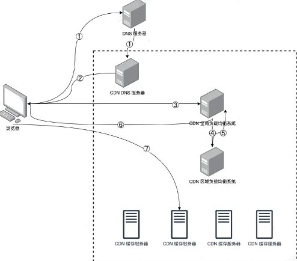
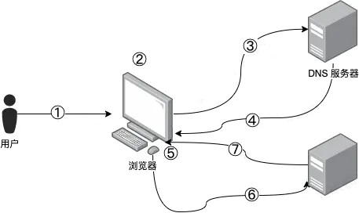

[返回](./#/other/)

浏览器请求过程：

1. 用户在浏览器中输入要访问的网址域名。
2. 浏览器向本地 DNS 服务器请求对域名的解析。
3. 如果本地 DNS 服务器有域名的解析结果，那么直接响应用户请求，返回该域名对应的 IP 地址。
4. 如果本地 DNS 服务器没有域名的解析结果，那么则会递归地向 DNS 系统请求解析，随后将该结果返回给用户。
5. 浏览器得到域名解析结果后，其实也就是域名对应的 IP 地址。
6. 随后浏览器向服务器请求内容。
7. 服务器将用户请求内容返回给浏览器。

如图：

1. CDN 就是内容分发网络的意思，其英文全称为 Content Delivery Network。简单地说，CDN 可以提前把数据存在离用户最近的数据节点，从而避免长途跋涉经过长途骨干网，最终达到减少骨干网负担、提高访问速度的目的。其流程如下：

2. 浏览器发起图片 URL 请求，经过本地 DNS 解析，会将域名解析权交给域名 CNAME 指向的 CDN 专用 DNS 服务器。
3. CDN 的 DNS 服务器将 CDN 的全局负载均衡设备 IP 地址返回给浏览器。
4. 浏览器向 CDN 全局负载均衡设备发起 URL 请求。
5. CDN 全局负载均衡设备根据用户 IP 地址，以及用户请求的 URL，选择一台用户所属区域的区域负载均衡设备，向其发起请求。
6. 区域负载均衡设备会为用户选择最合适的 CDN 缓存服务器（考虑的依据包括：服务器负载情况，距离用户的距离等），并返回给全局负载均衡设备。
7. 全局负载均衡设备将选中的 CDN 缓存服务器 IP 地址返回给用户。
8. 用户向 CDN 缓存服务器发起请求，缓存服务器响应用户请求，最终将用户所需要偶的内容返回给浏览器。

如图：

[返回](./#/other/)