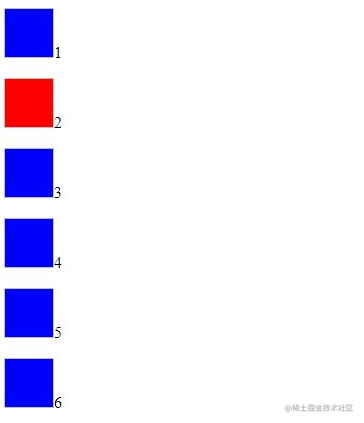

[返回](./#/css/)

## nth-child、last-child 伪类

```html
<style>
  .list img {
    background: blue;
    width: 50px;
    height: 50px;
  }
  .list > p:nth-child(even) img {
    background: red;
  }
  .list > p:last-child img {
    background: orange;
  }
</style>

<div class="list">
  <p>1</p>
  <p>2</p>
  <div class="sub-list">
    <p>3</p>
    <p>4</p>
  </div>
  <!-- <div class="sub-list"></div> -->
  <p>5</p>
  <div class="sub-list">
    <p>6</p>
  </div>
</div>
```

运行结果：


结论：先匹配同层级伪类，然后再是目标标签，比如 p:last-child，先匹配该 p 的同层级的最后一个元素，然后再匹配 p,如果 p 不是该层级的最后一个元素，则未命中

last-child 代表在一群兄弟元素中的最后一个元素\
last-of-type表示其父元素下的最后一个指定类型的元素

[返回](./#/css/)